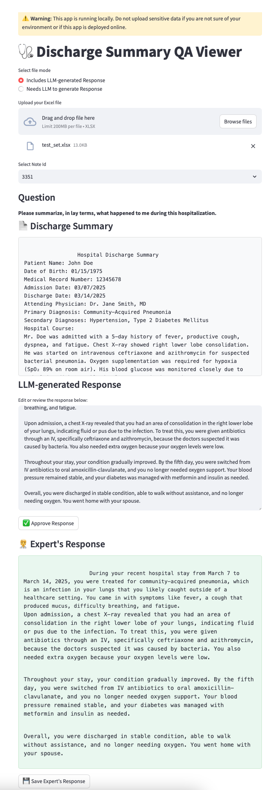

<!--
This source file is part of the ARPA-H CARE LLM project

SPDX-FileCopyrightText: 2025 Stanford University and the project authors (see AUTHORS.md)

SPDX-License-Identifier: MIT

-->

# Medical QA Reviewer

This is a Streamlit-based application for reviewing and editing LLM-generated responses in medical settings. It supports two usage modes:

1. **Pre-generated Responses Mode** — Upload an Excel file with LLM-generated responses already included.
2. **Prompt-to-LLM Mode** — Upload an Excel file with only prompts, and the app will generate responses using a placeholder LLM function (which you can replace with a real model call).

---

## Input File Formats

Depending on your selected mode, the Excel file should follow one of these formats:

### Mode 1: Includes LLM-generated Response
| Note Id | Clinical Text | Question | LLM-generated Response |
|---------|--------------------|----------|-------------------------|

### Mode 2: Needs LLM to generate Response
| Note Id | Clinical Text | Question | Prompt |
|---------|--------------------|----------|--------|

> ⚠️ When using Mode 2, the app ignores any existing `LLM-generated Response` column and generates new responses using a placeholder function.

---

## How to Run

### Prerequisites

- Python `3.8+`
- Dependencies listed in `requirements.txt`

### Installation

```bash
git clone https://github.com/YOUR_USERNAME/medical-qa-reviewer.git
cd medical-qa-reviewer
pip install -r requirements.txt
```

### Start the App
```bash
streamlit run qa_expert_reviewer_app.py
```

_This is an app screenshot from a hospital discharge patient question answering use case, where users review and validate LLM-generated answers based on clinical summaries._



### Column Name Abstraction

To support flexibility across different datasets and institutions, the app uses an abstract interface called `ExcelFileColumnInterface` to define the expected column names in the uploaded Excel files.

Different teams might name their columns differently (e.g., `"Note Id"` vs. `"RecordID"`). Rather than hardcoding column names throughout the app, this interface allows developers to plug in their own mappings by subclassing and overriding only what they need.

To customize the column names, create a new class that inherits from ExcelFileColumnInterface and override the relevant properties:

```python
from columns_interface import ExcelFileColumnInterface

class DischargeSummaryExcelFileColumns(ExcelFileColumnInterface):
    """Default column names for standard medical QA review."""

    @property
    def NOTE_ID(self): return "Note Id"

    @property
    def QUESTION(self): return "Question"

    @property
    def CLINICAL_TEXT(self): return "Discharge Summary"

    @property
    def LLM_GENERATED_RESPONSE(self): return "LLM-generated Response"

    @property
    def PROMPT(self): return "Prompt"

    @property
    def EXPERT_RESPONSE(self): return "Expert's Response"
```

Then, in `qa_expert_reviewer_app.py`, replace the default class with your own:

```python
from columns_interface import CustomExcelColumns
col = CustomExcelColumns()
``` 


### About the LLM Integration

The app includes a function called generate_llm_response_from_prompt() as a placeholder.
```python
def generate_llm_response_from_prompt(prompt, clinical_text, question):
    """
    Placeholder for real LLM API call. Replace this with OpenAI, Vertex AI, Claude, etc.
    """
    return "Generated response based on your prompt and text..."
```

To connect it to a real LLM (like OpenAI's GPT-4 or Google's Gemini), replace this function with the actual API call and handle authentication.


### Disclaimer

This app is for local use and prototyping only. Do not upload sensitive or identifiable patient data unless deployed in a secure, compliant environment.


### License

MIT License